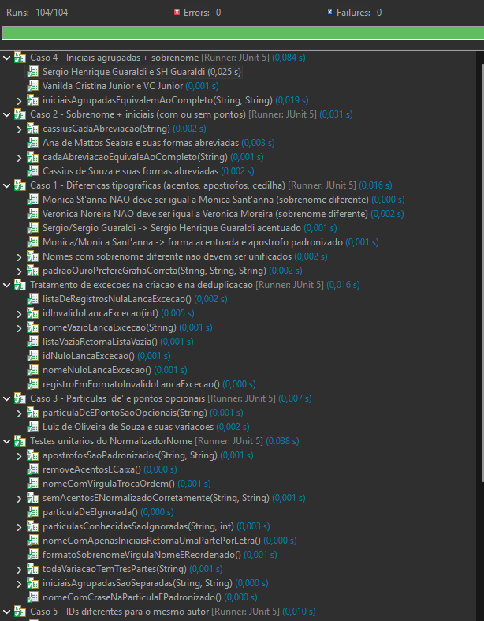

<h1 align="center">
  
  <br>
  Deduplicação de Autores
  <br>
  <sub><sup>Curadoria de dados de autoria científica - padrão-ouro</sup></sub>
</h1>

<p align="center">
  
  
  
</p>

<p align="center">
  
  
  
  
</p>

<p align="center">
  Aplicação em <b>Java</b> que limpa listas de autores científicos: descobre quando
  vários registros são, na verdade, <b>a mesma pessoa</b> escrita de formas diferentes
  e os unifica em um único registro padrão.
</p>

<p align="center">
  <i>Enunciado completo da disciplina em <a href="ENUNCIADO.md">ENUNCIADO.md</a>.</i>
</p>

---

## Equipe

<p align="center">Nome e <b>matrícula</b> de cada integrante do grupo:</p>

<table align="center">
  <tr>
    <td align="center">
      <a href="https://github.com/kalebmacedo">
        <br>
        <sub><b>Kaleb de Souza Macedo</b></sub>
      </a><br>
      <sub>231026975</sub>
    </td>
    <td align="center">
      <a href="https://github.com/MateuSansete">
        <br>
        <sub><b>Mateus Bastos dos Santos</b></sub>
      </a><br>
      <sub>211062240</sub>
    </td>
    <td align="center">
      <a href="https://github.com/leozinlima">
        <br>
        <sub><b>Leonardo de Melo Lima</b></sub>
      </a><br>
      <sub>222037700</sub>
    </td>
    <td align="center">
      <a href="https://github.com/Bessazs">
        <br>
        <sub><b>Vitor Pereira Bessa</b></sub>
      </a><br>
      <sub>180132466</sub>
    </td>
    <td align="center">
      <a href="https://github.com/FelipeFreire-gf">
        <br>
        <sub><b>Felipe das Neves Freire</b></sub>
      </a><br>
      <sub>202046102</sub>
    </td>
  </tr>
</table>

---

## O que é "deduplicar autores"?

A mesma pessoa costuma aparecer escrita de jeitos diferentes em cada base de
dados: com acento ou sem, com o nome completo ou só as iniciais, com o
sobrenome na frente, com IDs diferentes. **Deduplicar** é juntar todas essas
variações em **um único registro correto**.

<table align="center">
  <tr><th>Entra (vários registros)</th><th>Sai (unificado)</th></tr>
  <tr><td>28372 - Ana de Mattos Seabra</td><td>28372 - Ana de Mattos Seabra</td></tr>
  <tr><td>582585 - A. M. Seabra</td><td>28372 - Ana de Mattos Seabra</td></tr>
  <tr><td>582585 - AM Seabra</td><td>28372 - Ana de Mattos Seabra</td></tr>
</table>

Regras da unificação:

- **Nome** fica a forma mais completa e melhor escrita.
- **ID** fica sempre o **menor** entre os registros iguais.

---

## Problemas que o sistema resolve

| Caso | Problema | Exemplo |
|:----:|----------|---------|
| 1 | Acentos, apóstrofos, cedilha | "Monica Sant\`anna" = "Mônica Sant'anna" |
| 2 | Sobrenome + iniciais | "Cassius de Souza" = "Souza C." |
| 3 | Partícula "de" e pontos opcionais | "Luiz Oliveira Souza" = "Luiz de Oliveira de Souza" |
| 4 | Iniciais agrupadas | "VC Junior" = "Vanilda Cristina Junior" |
| 5 | IDs diferentes p/ mesmo autor | vira o menor ID |

---

## Como o TDD foi aplicado

Ciclo **Red → Green**:

1. **Red** - escrevemos primeiro os testes de cada caso e rodamos com classes
   "stub" vazias. Resultado: **tudo falhou**.
2. **Green** - implementamos o mínimo necessário (`NormalizadorNome`,
   `ComparadorAutor`, `Deduplicador`) até **todos passarem**.
3. Sem refatoração formal - isso é tarefa do TP2.

---

## Ficha técnica

- **Linguagem:** Java 21
- **Framework de testes:** JUnit 5 - versão **5.10.2**
- **Build / execução:** Maven
- **IDEs:** VS Code "atente às intruções" e Eclipse

---

## Como rodar os testes

### Opção A - Eclipse (Build automático)

O Eclipse lê o `pom.xml` e baixa o JUnit sozinho - não precisa do Maven no PATH.

1. **File → Import... → Maven → Existing Maven Projects**.
2. Em **Root Directory**, selecione a pasta do projeto e confirme que o
   `pom.xml` aparece marcado; clique em **Finish** (na primeira vez ele baixa
   o JUnit, pode demorar um pouco).
3. Para rodar **tudo**: botão direito na pasta `src/test/java` (ou no projeto)
   → **Run As → JUnit Test**.
4. Para rodar **um caso/classe/suíte**: botão direito no arquivo desejado
   (ex.: `Caso1TipograficoSuite`) → **Run As → JUnit Test**.
5. Para rodar **tudo por uma suíte só**: botão direito em
   `TodosOsTestesSuite` → **Run As → JUnit Test**.

Resultado esperado: a aba **JUnit** com a **barra verde** e **0 failures / 0 errors**.

> Se a opção *JUnit Test* não aparecer, faça botão direito no projeto →
> **Maven → Update Project...** para reconstruir o classpath, e confirme um
> **JDK 21+** em *Properties → Java Build Path*.

Exemplo de resultado no Eclipse:

<p align="center">
  
</p>

<p align="center">
  <sub><b>104 execuções de teste passando</b> (métodos simples + cada caso dos testes parametrizados), com 0 falhas e 0 erros.</sub>
</p>

### Opção B - Terminal / (VS Code precisa instalar o Maven)

No terminal (ou no terminal integrado do VS Code), na raiz do projeto:

```bash
mvn test
```

Rodar só uma categoria (usamos `@Tag`):

```bash
mvn test -Dgroups=exception      # só testes de exceção
mvn test -Dgroups=parametrized   # só testes parametrizados
```

Rodar a suíte de um caso específico:

```bash
mvn test -Dtest=Caso1TipograficoSuite   # só o Caso 1
mvn test -Dtest=Caso5UnificacaoIdSuite  # só o Caso 5
```

Resultado esperado: **BUILD SUCCESS**, com 0 falhas.

---

## Testes que cobrimos

### Como modelamos os testes

A suíte foi pensada para casar com o ciclo de TDD e com os recursos exigidos pela disciplina. As principais decisões de modelagem:

- **Testes parametrizados (`@ParameterizedTest`).** Cada caso de
  deduplicação tem várias formas de escrever o mesmo nome. Em vez de um método
  por variação, usamos um único método que recebe **vários conjuntos de dados**
  (via `@CsvSource` / `@ValueSource`). Por isso o número de **execuções** é maior
  que o número de **métodos**: cada linha de dado de um teste parametrizado conta
  como uma execução separada.

> **Execuções (69 vs 104).** Rodando a suíte mestra
> `TodosOsTestesSuite`, cada classe de teste roda **uma única vez** → **69
> execuções** (o número real e sem duplicação). Já ao mandar rodar *tudo* pela
> pasta `src/test/java`, o Eclipse executa as 7 classes de teste **e também** as
> 5 suítes de caso (`Caso1TipograficoSuite`, etc.), que *re-executam* as mesmas
> classes dos casos — inflando o total para **104** (`69 + 35` execuções dos
> casos contadas em dobro). Em ambos os cenários todos os testes passam; a
> diferença é apenas dupla contagem, não testes a mais.

- **Testes unitários puros.** O `NormalizadorNomeTest` valida o algoritmo (remoção de acentos, pontuação, partículas) de forma isolada, sem
  depender das demais classes.
- **Testes de exceção.** O `ExcecaoTest` garante o comportamento de erro (nome nulo/vazio, id inválido, lista nula) usando `assertThrows`.
- **Categorias / tags (`@Tag`).** Os testes são marcados por tema (`typographic`, `initials`, `exception`...), permitindo rodar só um grupo
  com `-Dgroups=...`.
- **Suíte por caso.** Cada caso tem uma suíte (ex.: `Caso1TipograficoSuite`)
  que agrega seus testes, facilitando rodar/avaliar um caso isoladamente.
  Há ainda uma **suíte mestra** (`TodosOsTestesSuite`) que agrega todas as
  classes de teste em um único ponto de execução.

Recursos de teste exigidos pela disciplina:

| Recurso | Onde |
|---------|------|
| Testes unitários | `NormalizadorNomeTest` |
| Testes parametrizados | `@ParameterizedTest` em todos os casos |
| Testes de exceção | `ExcecaoTest` |
| Categorias / tags | `@Tag` (`typographic`, `initials`, `exception`...) |
| Suíte de testes | uma por caso (ex.: `Caso1TipograficoSuite`) |

Cada caso tem seu teste e sua suíte, com **pelo menos 2 conjuntos de dados**:

| Caso | Teste | Suíte do item |
|:----:|-------|---------------|
| 1 - Tipográfico | `VariacaoTipograficaTest` | `Caso1TipograficoSuite` |
| 2 - Sobrenome + iniciais | `SobrenomeIniciaisTest` | `Caso2SobrenomeIniciaisSuite` |
| 3 - Partícula "de" | `ParticulasAbreviacoesTest` | `Caso3ParticulasSuite` |
| 4 - Iniciais agrupadas | `IniciaisAgrupadasTest` | `Caso4IniciaisAgrupadasSuite` |
| 5 - Menor ID | `UnificacaoIdTest` | `Caso5UnificacaoIdSuite` |

---

## Classes principais

| Classe | Responsabilidade |
|--------|------------------|
| `RegistroAutor`   | Registro de autoria (`id` + `nome`), com validação |
| `NormalizadorNome`| Normaliza o nome em "peças" comparáveis (sem acento, sem pontuação, partículas opcionais) |
| `ComparadorAutor` | Diz se dois nomes são a mesma pessoa |
| `Deduplicador`    | Agrupa os iguais e gera os registros unificados |

---

## Estrutura

```
trabalho-tppe/
├── pom.xml                                  # Maven + JUnit 5
├── README.md
├── ENUNCIADO.md                             # enunciado da disciplina
├── docs/
│   └── images/                              # logo e captura dos testes
└── src/
    ├── main/java/br/unb/tppe/dedup/         # código da solução
    │   ├── RegistroAutor.java               #   registro (id + nome) + validação
    │   ├── NormalizadorNome.java            #   normaliza o nome em peças comparáveis
    │   ├── ComparadorAutor.java             #   diz se dois nomes são a mesma pessoa
    │   └── Deduplicador.java                #   agrupa iguais e unifica
    └── test/java/br/unb/tppe/dedup/         # testes JUnit 5 (1 arquivo por caso)
        ├── ApoioTestes.java                 #   utilitários de teste
        ├── NormalizadorNomeTest.java        #   Caso base - testes unitários
        ├── VariacaoTipograficaTest.java     #   Caso 1 - teste
        ├── Caso1TipograficoSuite.java       #   Caso 1 - suíte
        ├── SobrenomeIniciaisTest.java       #   Caso 2 - teste
        ├── Caso2SobrenomeIniciaisSuite.java #   Caso 2 - suíte
        ├── ParticulasAbreviacoesTest.java   #   Caso 3 - teste
        ├── Caso3ParticulasSuite.java        #   Caso 3 - suíte
        ├── IniciaisAgrupadasTest.java       #   Caso 4 - teste
        ├── Caso4IniciaisAgrupadasSuite.java #   Caso 4 - suíte
        ├── UnificacaoIdTest.java            #   Caso 5 - teste
        ├── Caso5UnificacaoIdSuite.java      #   Caso 5 - suíte
        ├── ExcecaoTest.java                 #   testes de exceção
        └── TodosOsTestesSuite.java          #   suíte mestra
```
